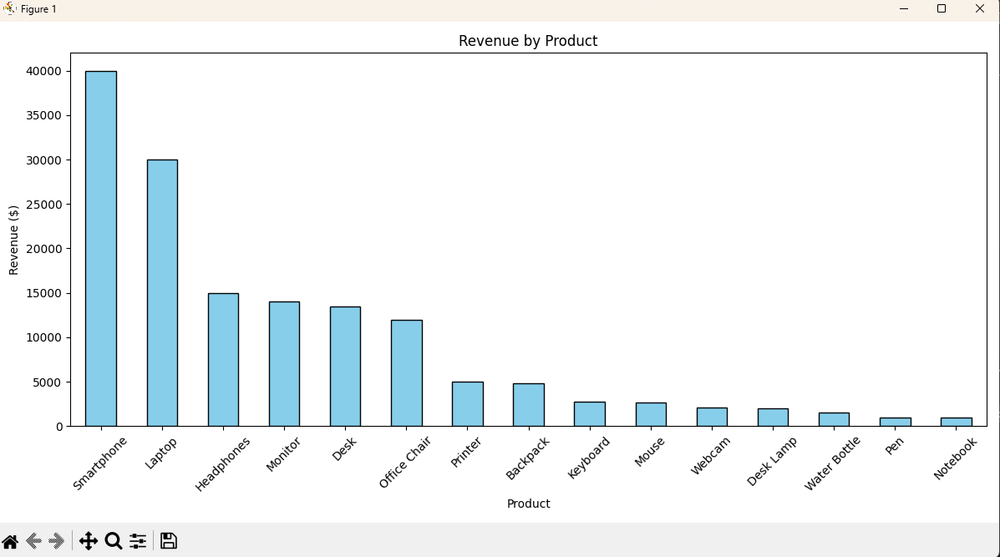

# Sales Data Analysis and Visualization

This project demonstrates data analysis and visualization using Python. It reads sales data from a CSV file, calculates revenue by product, and generates a bar chart to visualize the results.

---

## Features
- Analyze CSV sales data with **pandas**  
- Calculate **total revenue by product**  
- Visualize results using **Matplotlib**  
- Easy to run for anyone reviewing the code  

---

## Installation
Clone the repository and install dependencies:

```bash
pip install pandas matplotlib
```

## How to Run
1. Make sure `sales_data.csv` is in the same folder as `analyze_sales.py`.  
2. Run the script:

```bash
python analyze_sales.py
```

---

## Sample Output

### Terminal


### Revenue Bar Chart


---

## Project Details
- CSV contains multiple products with varying quantities, prices, and categories to simulate real-world data.  
- Revenue calculation demonstrates numeric manipulation and data aggregation.  
- Bar chart visualization is formatted with colors, labels, and rotated x-axis for readability.  

---

## Future Improvements
- Add **line charts** to show trends over time  
- Handle **larger datasets** dynamically  
- Export analysis results to **Excel or PDF** for reporting  

---

## Skills Demonstrated
- Python programming and scripting  
- Data analysis with **pandas**  
- Data visualization with **Matplotlib**  
- File handling and CSV manipulation
